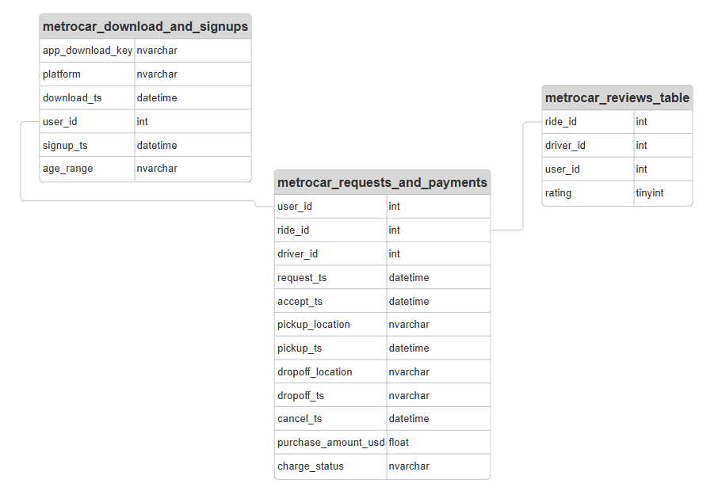
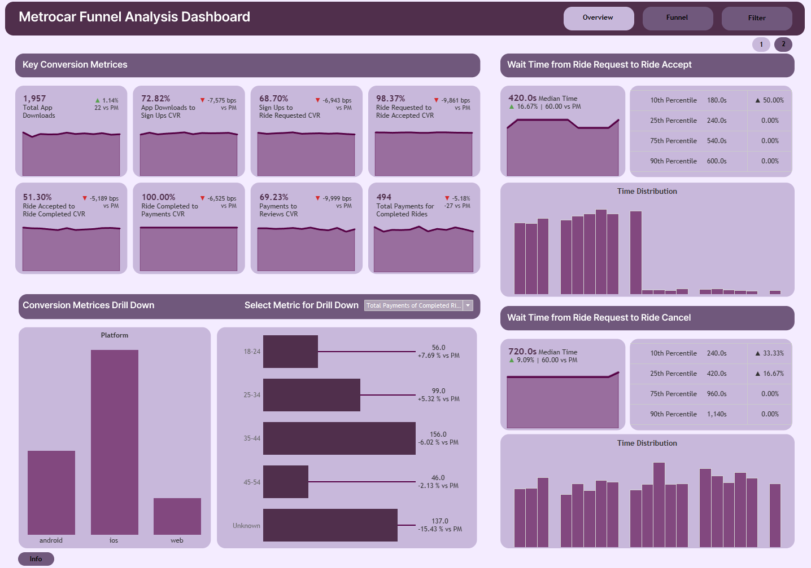
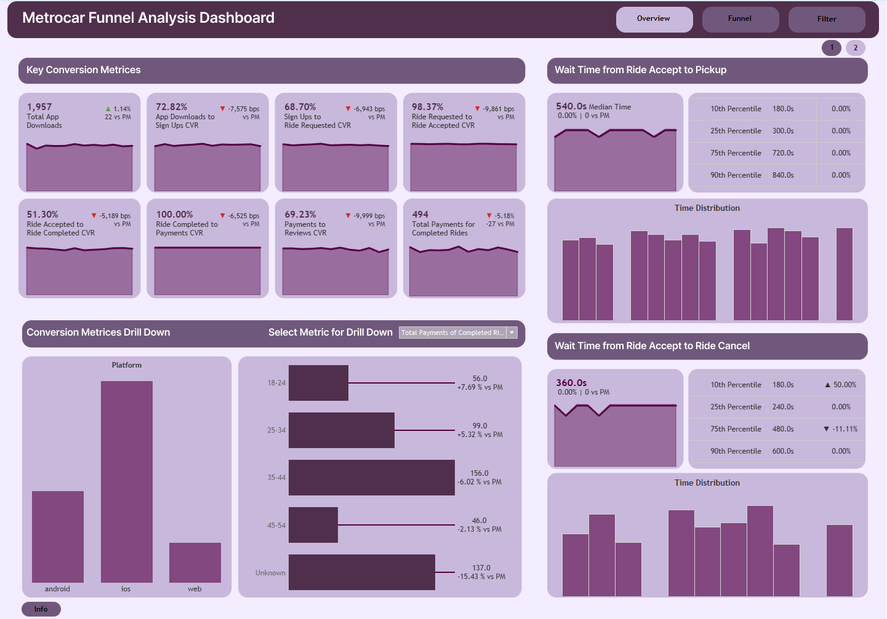
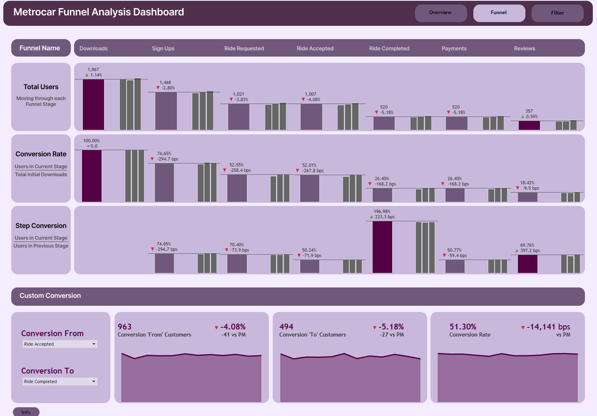

# Funnel Analysis Dashboard
For interactive dashboard experience click [here](https://public.tableau.com/views/MetrocarFunnelAnalysis_17424678485000/Overview-1?:language=en-US&:sid=&:redirect=auth&:display_count=n&:origin=viz_share_link)

## Project Overview
Metrocar is a ride-sharing platform that connects riders and drivers through a mobile app, operating in urban and semi-urban markets. With growing user acquisition, Metrocar needed a way to analyze user behavior from app download to ride feedback and optimize for conversion and retention at every stage of the funnel.

## Objective
Design a comprehensive and interactive funnel performance dashboard to:

- Track user progression across the core journey: from app download to review submission
- Monitor conversion rates and drop-offs monthly and quarterly
- Compare funnel behavior by platform and user demographics
- Analyze ride-related wait times affecting conversion

## ERD

## Metrices
 The following metrics and visualizations are included across the five key sections:

### 1. Key Conversion Metric 
- Conversion Rate (CVR): % of users moving from one step to the next
- MoM Growth Rate (bps): Change in conversion rate from the previous month in basis points
- Line Chart: Visual trend analysis of monthly performance

#### **Funnel Stages:**
1. App Downloads: Number of unique installs of the Metrocar app
2. Download → Sign-Up CVR:  % of downloads resulting in user registrations
3. Sign-Up → Ride Requested CVR: % of registered users who initiated a ride request
4. Ride Requested → Ride Accepted CVR: % of ride requests that were accepted by drivers
5. Ride Accepted → Ride Completed CVR: % of accepted rides that reached successful completion
6. Ride Completed → Payment CVR: % of completed rides where payment was successfully processed
7. Payment → Review CVR: % of paid rides that resulted in user feedback/review submission
8. Total Payments for Completed Rides: Aggregate revenue (or count of successful payments)

### 2. Drill Down Segment
User selects Funnel stage for interactive views to compare segment-specific behavior among users from different platforms (iOS/Android/Web), and age groups.

### 3. Ride-Related Wait Time Analysis
Focused on understanding operational inefficiencies impacting user experience and funnel progression.
1. Median wait time (monthly + MoM change in seconds)
2. 10th, 25th, 75th, 90th percentiles of wait times
3. Histogram of customer distribution across wait time bins

#### **Funnel Stages:**
1. Request → Accept: Time from when the user requests a ride to when a driver accepts
2. Request → Cancel: Time before a ride is cancelled by either party
3. Accept → Pickup:	Time between ride acceptance and driver arrival
4. Accept → Cancel:	Time before the driver or user cancels post-acceptance

### 4. Monthly and Quarterly Average Funnel Analysis
Helps compare overall quarterly performance against month-wise trends of user progression through each stage of the funnel
1. Total users at each funnel stage
2. Conversion rate (CR)
3. Step-to-step conversion (relative CR)

### 5. Custom Funnel Conversion Tool
Dynamic selectors for any “From” and “To” funnel steps are used to calculate KPIs:     
1. Users at starting stage
2. Users reaching target stage
3. Conversion rate between selected steps
4. MoM growth rate for all above

## Screenshots
#### Overview Page 1

#### Overview Page 2

#### Funnel Analysis

